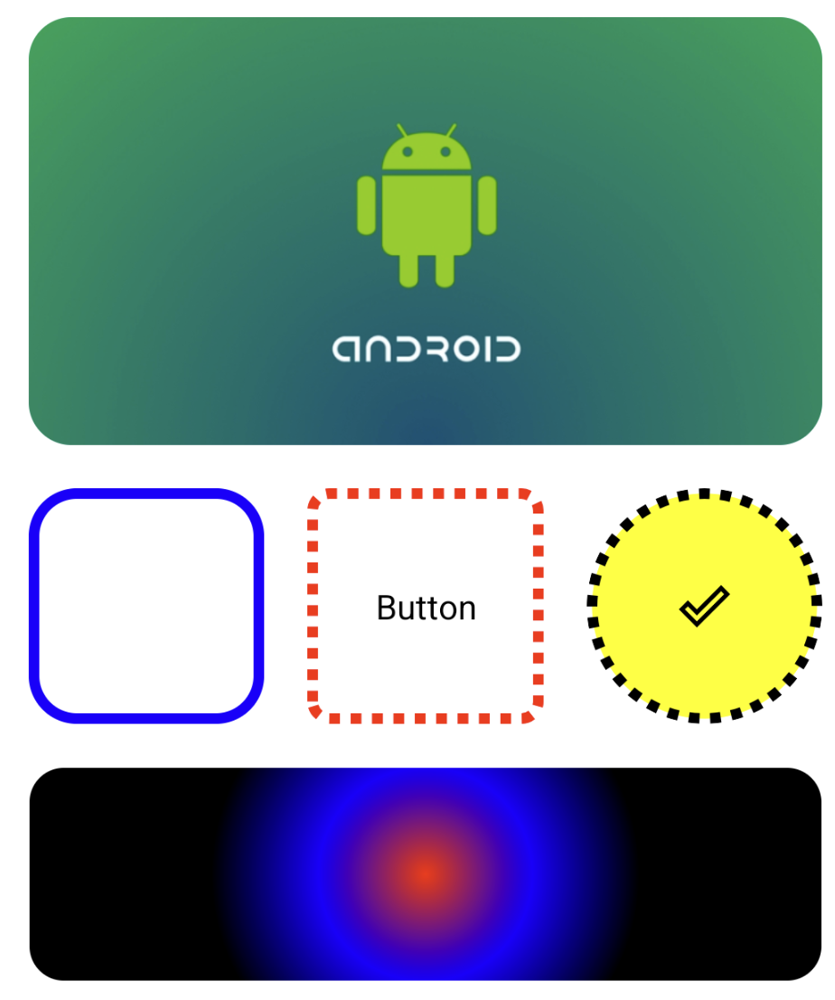

# ShapeView

**ShapeDrawable** allows you to directly use attributes such as `Shape`, `Stroke`, `Color`, `Ripple`, `Gradient` in XML
without the need to create a separate ShapeDrawable file.

## Preview


## Install

```kotlin
dependencyResolutionManagement {
    ..
    repositories {
        ..
        maven("https://maven.pkg.github.com/dylan-kwon/android-shape-view") {
            credentials {
                username = INPUT-YOUR-USER-NAME
                password = INPUT-YOUR-GITHUB-TOKEN
            }
        }
    }
}
```

```kotlin
implementation("dylan.kwon:shape-view:$version")
```

## How To Use

```xml

<dylan.kwon.shapeview.ShapeView
    app:cornerRadius="8dp"

    app:solidColor="@color/white"

    app:strokeColor="@color/black"
    app:strokeWidth="5dp"
    app:strokeDashWidth="5dp"
    app:strokeDashGap="5dp"

    app:rippleColor="@color/red"
    app:rippleEnabled="@color/red"

    app:useClip="true"

    app:gradientType="radial"
    app:gradientOrientation="LEFT_RIGHT"
    app:gradientStartColor="@color/red"
    app:gradientCenterColor="@color/blue"
    app:gradientEndColor="@color/black"
    app:gradientRadius="100dp"
    app:gradientX="0.5"
    app:gradientY="0.5">

    <!--    Put your child view here    -->

</dylan.kwon.shapeview.ShapeView>
```

## Supports DataBinding
```xml

<dylan.kwon.shapeview.ShapeView
    app:strokeColor="@{viewModel.isError ? @color/red : @color/green}"
/>
```


## All Attributes

The full list of supported attributes is as follows:

### Stroke

| Attribute           | Type  | description                                                             |
|---------------------|-------|-------------------------------------------------------------------------|
| app:strokeColor     | color | Specifies the color of the Stroke                                       |
| app:strokeWidth     | dp    | Specifies the width of the Stroke                                       |
| app:strokeDashWidth | dp    | Applies a dash effect to the Stroke and specifies the width of the dash |
| app:strokeDashGap   | dp    | Specifies the interval between dashes                                   |

### Ripple

| Attribute       | Type    | description                                 |
|-----------------|---------|---------------------------------------------|
| app:rippleColor | color   | Specifies the color of the Ripple           |
| app:useRipple   | boolean | Determines whether to use the Ripple effect |

### Corner Radius

| Attribute             | Type | description                                               |
|-----------------------|------|-----------------------------------------------------------|
| app:cornerRadius      | dp   | Specifies the corner rounding for all directions          |
| app:topLeftRadius     | dp   | Specifies the corner rounding for the top-left corner     |
| app:topRightRadius    | dp   | Specifies the corner rounding for the top-right corner    |
| app:bottomLeftRadius  | dp   | Specifies the corner rounding for the bottom-left corner  |
| app:bottomRightRadius | dp   | Specifies the corner rounding for the bottom-right corner |

### Gradient

| Attribute               | Type  | description                                                                         |
|-------------------------|-------|-------------------------------------------------------------------------------------|
| app:gradientType        | enum  | `linear` `radial` `sweep`                                                           |
| app:gradientOrientation | enum  | `TOP_BOTTOM` `TR_BL` `RIGHT_LEFT` `BR_TL` `BOTTOM_TOP` `BL_TR` `LEFT_RIGHT` `TL_BR` |
| app:gradientStartColor  | color | Specifies the start color of the gradient                                           |
| app:gradientCenterColor | color | Specifies the center color of the gradient                                          |
| app:gradientEndColor    | color | Specifies the end color of the gradient                                             |
| app:gradientRadius      | dp    | Specifies the radius of the gradient                                                |
| app:gradientX           | float | Specifies the x-position of the gradient (0~1)                                      |
| app:gradientY           | float | Specifies the y-position of the gradient (0~1)                                      |

### Etc

| Attribute      | Type    | description                                                      |
|----------------|---------|------------------------------------------------------------------|
| app:solidColor | color   | Specifies the background color                                   |
| app:useClip    | boolean | Determines whether to apply a cut according to the Corner Radius |

## License

This project is licensed under the Apache License, Version 2.0. - see the [LICENSE](./LICENSE.txt) file for details.